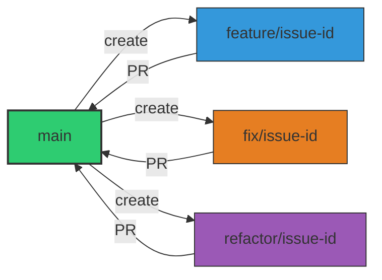

# 🌿 Stratégie Git & Branching Model

## 1. Objectif de ce document

Ce document définit **le modèle Git officiel du projet**.

Il vise à :
- réduire les erreurs humaines
- garantir la stabilité de la branche principale
- simplifier l’onboarding
- permettre l’automatisation complète (CI/CD, releases)

👉 Toute contribution doit respecter strictement ce modèle.

---

## 2. Principes directeurs

- **Une seule branche stable**
- **Des branches courtes et jetables**
- **Un flux linéaire et lisible**
- **Zéro commit direct sur la branche principale**
- **Automatisation avant discipline humaine**

---

## 3. Branches officielles

### 3.1 `main`

La branche `main` est :

- **toujours déployable**
- protégée
- source des releases
- strictement immuable sans PR

❌ Aucun commit direct n’est autorisé.

---

### 3.2 Branches de travail

Les branches de travail sont **temporaires** et **liées à une issue**.

| Type | Préfixe | Exemple |
|---|---|---|
| Feature | `feature/` | `feature/123-user-login` |
| Bugfix | `fix/` | `fix/456-null-pointer` |
| Refactor | `refactor/` | `refactor/789-clean-arch` |
| Tech Debt | `tech/` | `tech/321-remove-legacy` |
| Docs | `docs/` | `docs/112-api-readme` |
| Security | `security/` | `security/999-token-leak` |

👉 Le numéro d’issue est **obligatoire**.

---

## 4. Règles de nommage

Format obligatoire :

<prefix>/<issue-id>-<slug>

Exemple :

❌ Toute branche non conforme sera refusée en CI.

---

## 5. Cycle de vie d’une branche

1. Création depuis `main`
2. Développement local
3. Push sur GitHub
4. Pull Request
5. Validation CI
6. Revue de code
7. Merge
8. Suppression automatique de la branche

---

## 6. Flux Git standard (schéma)

## 7. Pull Requests (obligatoires)
Règles non négociables

Toute modification passe par une PR

Une PR = une intention claire

Une PR = une issue

La CI doit être verte

Une PR sans issue associée sera refusée.

## 8. Merge strategy
Stratégie officielle

Squash & Merge obligatoire

Pourquoi

historique linéaire

commits propres

rollback simplifié

changelog automatisable

## 9. Protection de la branche main
Règles GitHub requises

PR obligatoire

CI obligatoire

Review obligatoire (≥ 1 reviewer)

Historique linéaire

Branch deletion après merge

## 10. Hotfix & urgences
Principe

Même en urgence :

pas de commit direct sur main

respect du process

PR accélérée possible

Branche
fix/<issue-id>-critical

La CI reste obligatoire.

## 11. Versioning & Git

Le versioning est basé sur main

Les tags sont posés automatiquement

Aucun tag manuel en production

Voir le document RELEASE_STRATEGY.md.

## 12. Cas interdits

Interdits formellement :
- travailler directement sur main
- branches longues et divergentes
- merges manuels sans PR
- commits non traçables

## 13. Évolution du modèle

Toute modification du modèle Git :
- passe par une issue
- est documentée
- est validée par un Maintainer
